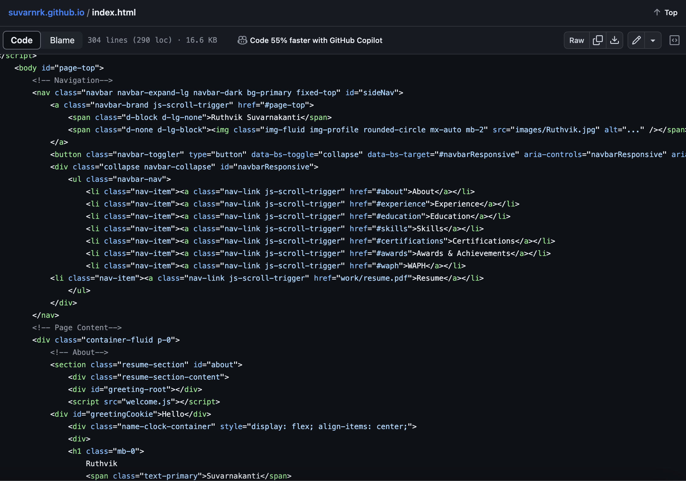
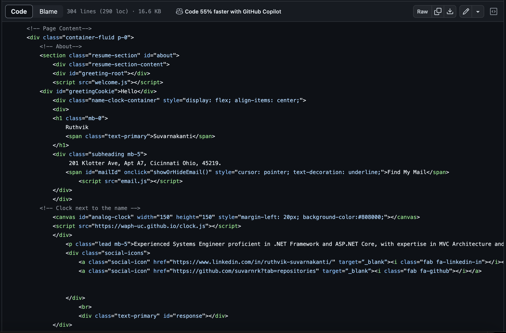
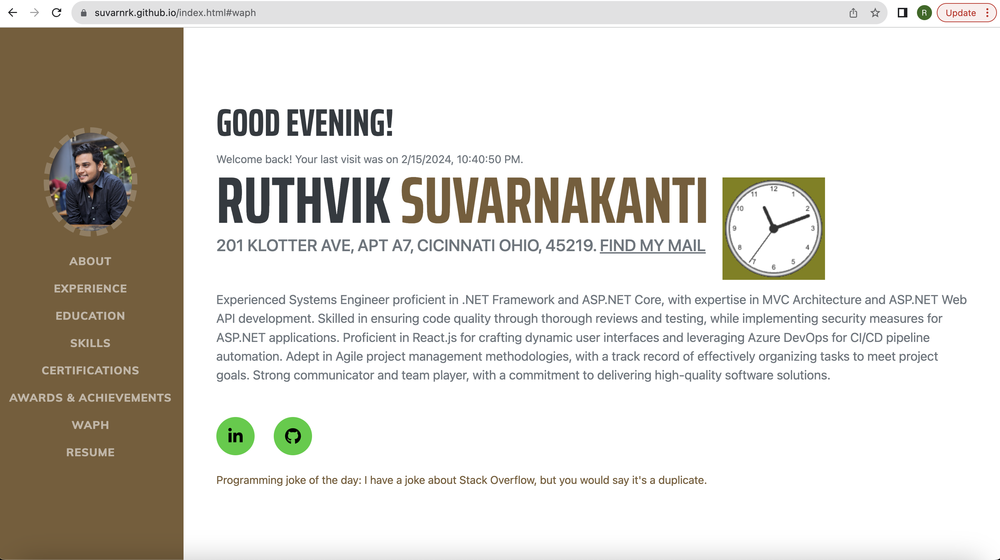
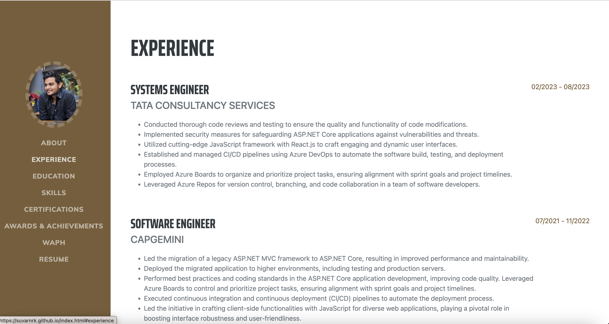
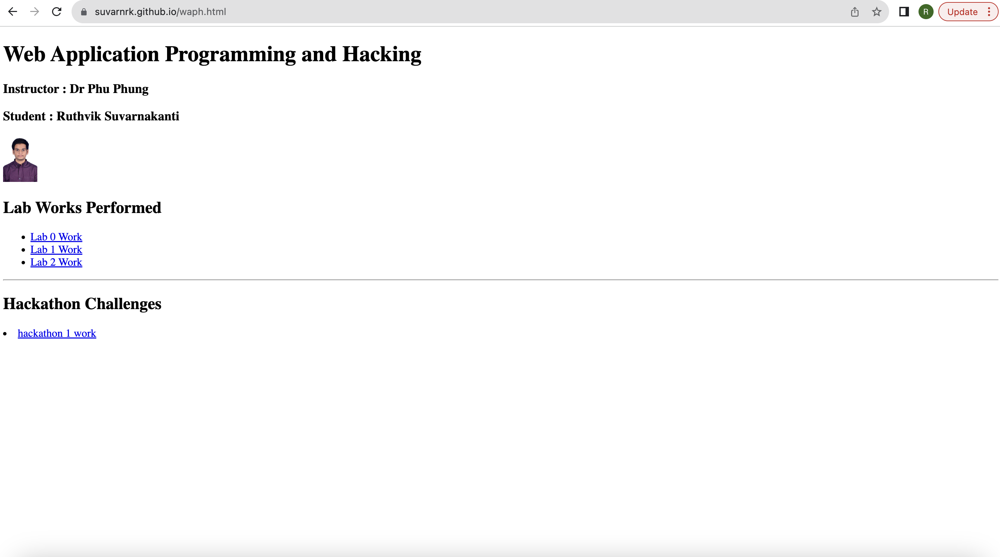
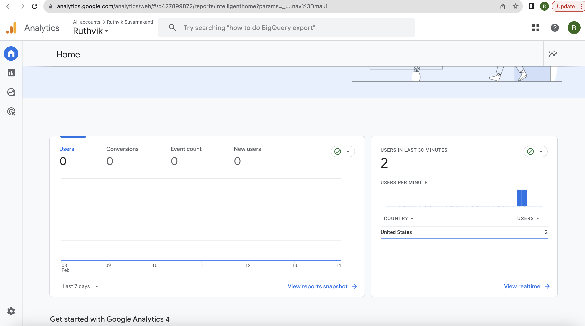
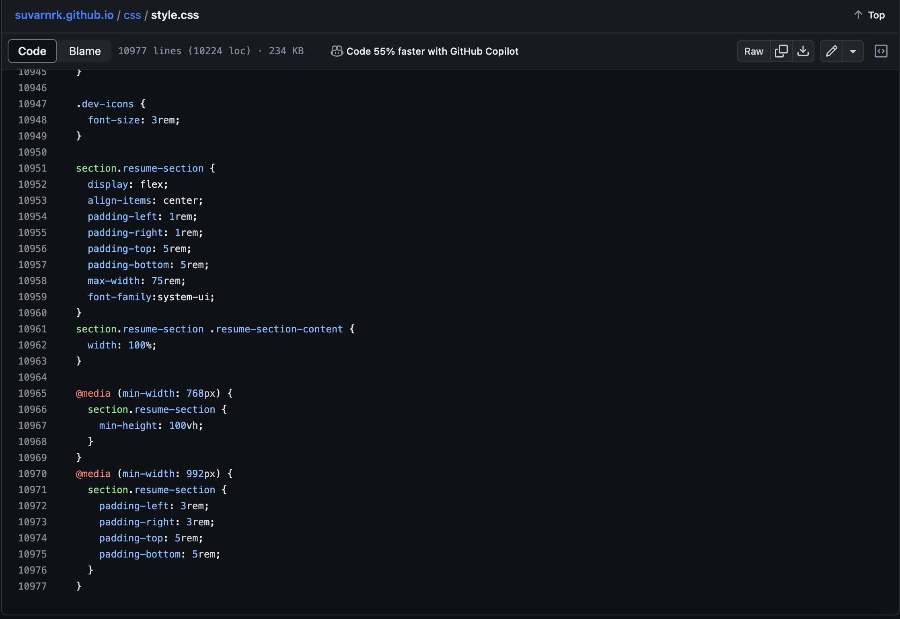
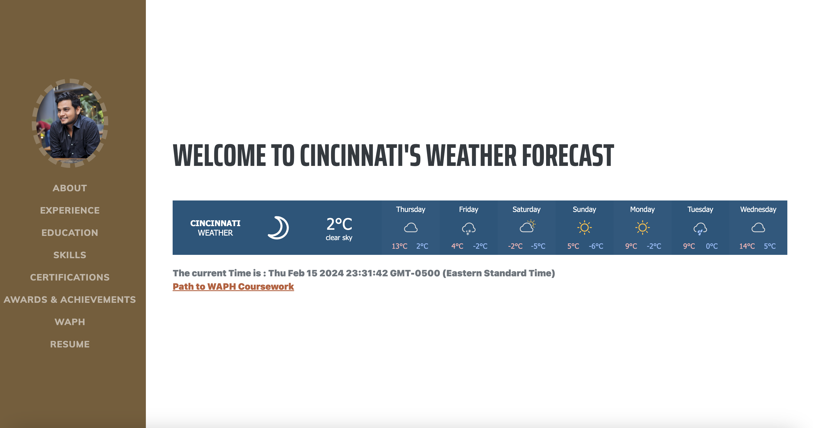
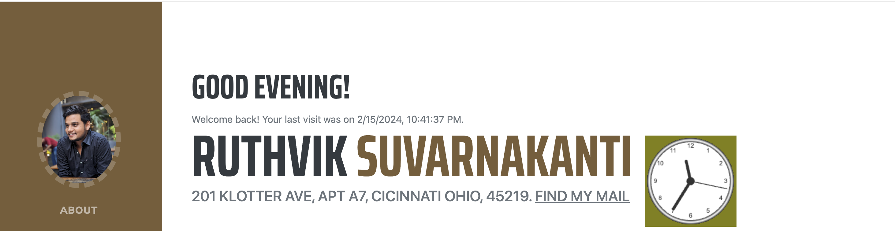

# WAPH-Web Application Programming and Hacking

## Instructor: Dr. Phu Phung

## Student

**Name**: Ruthvik Suvarnakanti

**Email**: suvarnrk@mail.uc.edu

{ width=150px height=150px }


## Individual Project 1 - Professional Profile Website

**Overview**: To fulfill the technical aspects of the project, a front-end web development initiative was undertaken to craft a professional profile website. Leveraging fundamental JavaScript, JQuery, and React library functionalities, the website was imbued with interactive elements and dynamic content. Integration of two public web APIs was seamlessly executed, enriching the user experience with real-time data retrieval. Employing JavaScript cookies further enhanced personalization, ensuring returning visitors are greeted warmly upon revisiting the site.

Complementing the technical requirements, a choice was made to adopt an open-source Bootstrap framework for streamlined design and layout development. Additionally, the inclusion of Google Analytics page tracker offers valuable insights into user engagement metrics, facilitating continuous optimization efforts. Through meticulous adherence to both technical and non-technical stipulations, the deployed website on GitHub Pages emerges as a polished showcase of skills and expertise, delivering an immersive and informative experience to its audience.

Link to the repository:
[https://github.com/suvarnrk/suvarnrk.github.io/blob/main/README.md](https://github.com/suvarnrk/suvarnrk.github.io/blob/main/README.md)

\pagebreak

I developed my personal portfolio by customizing a Bootstrap template to meet project requirements. It showcases my professional profile, including my name, headshot, contact details, educational background, work experiences, and skills. Additionally, I added a link to a new HTML page to present completed Hackathons and Labs from the WAPH course. This portfolio serves as a comprehensive overview of my qualifications, experiences, and achievements in web development. Through strategic customization and addition of relevant content, I aim to provide visitors with a clear understanding of my capabilities and accomplishments.

Link to Personal Portfolio:
[https://suvarnrk.github.io/index.html](https://suvarnakanti99.github.io/index.html)

\pagebreak

The below source code displays the information and navigation bar information , they include information about person, education, experiences, skills, certifications, resume and link to WAPH course work.







\pagebreak





\pagebreak

The link with WAPH coursework will take you to the detailed coursework done by us in labs and recent hackathon.




\pagebreak

The portfolio now includes a Google Analytics page tracker, enabling the monitoring of traffic and statistics. This integration allows for the comprehensive analysis of website engagement and visitor behavior. By leveraging Google Analytics, valuable insights into browsing patterns and user interactions are obtained. This data facilitates optimization efforts to enhance the portfolio's performance and user experience. Through this tracking feature, I aim to better understand audience engagement and refine the portfolio accordingly.


```JS

<!-- Google tag for page tracker-->
<script async src="https://www.googletagmanager.com/gtag/js?id=G-736JEW5RXQ"></script>
<!-- Google tag (gtag.js) -->
<script async src="https://www.googletagmanager.com/gtag/js?id=G-Z88DWME3X0"></script>
<script>
  window.dataLayer = window.dataLayer || [];
  function gtag(){dataLayer.push(arguments);}
  gtag('js', new Date());

  gtag('config', 'G-Z88DWME3X0');
</script>

```


\pagebreak

This portfolio is crafted using a combination of HTML, CSS, Bootstrap framework, JavaScript, and React library. These technologies work together to create a cohesive and dynamic user experience. HTML and CSS provide the foundational structure and styling, while Bootstrap ensures responsive design and layout consistency across devices. JavaScript adds interactivity and dynamic elements, enhancing user engagement. Integrating the React library further enhances the portfolio's functionality, allowing for efficient management of content and seamless navigation. Together, this tech stack forms the backbone of the portfolio, enabling the effective presentation of skills and experiences.



\pagebreak

The integration of JQuery facilitated the incorporation of two public APIs into the portfolio: a random joke generator web service and a weather widget web service. Every minute, a new random joke is displayed, adding a touch of humor to the user experience.

```JS

<script>


// Define a function to fetch and display a programming joke
function displayJoke() {
    // Make a GET request to the joke API
    $.get("https://v2.jokeapi.dev/joke/Programming?type=single", function(result) {
        // Log the joke retrieved from the API
        console.log("Joke from the API: " + JSON.stringify(result));
        
        // Check if a joke is retrieved successfully
        if (result && result.joke) {
            // Display the programming joke on the webpage
            $("#response").text("Programming Joke of the Day: " + result.joke);
        } else {
            // If no joke is retrieved, display a message
            $("#response").text("Could not retrieve a joke at this time.");
        }
    });
}

// Call the displayJoke function initially to show a joke
displayJoke();

// Set up an interval to call the displayJoke function every minute
setInterval(displayJoke, 60 * 1000);

```


</script>
```
\pagebreak


There is a weather widget code which displays the weathe forcatsing of cincinnati.

```JS


<div class="weather-widget">
    <a class="weatherwidget-io" href="https://forecast7.com/en/39d10n84d51/cincinnati/"
       data-label_1="CINCINNATI" data-label_2="WEATHER" data-theme="original">
        CINCINNATI WEATHER
    </a>
    <script>
        !function(d,s,id){
            var js,fjs=d.getElementsByTagName(s)[0];
            if(!d.getElementById(id)){
                js=d.createElement(s);
                js.id=id;
                js.src='https://weatherwidget.io/js/widget.min.js';
                fjs.parentNode.insertBefore(js,fjs);
            }
        }(document,'script','weatherwidget-io-js');
    </script>
</div>
```




\pagebreak

Additionally, code from Lab 2 has been incorporated, enhancing the portfolio with features such as a digital clock, analog clock, and functionality to show/hide email.


To enhance the portfolio's appeal, I integrated a custom greeting message feature using React. This functionality dynamically greets the user with "Good Morning," "Good Afternoon," or "Good Evening" based on the current time of day. By leveraging React, this personalized greeting adds a touch of interactivity and warmth to the user experience, fostering a more engaging and welcoming atmosphere.

```JS
<head>
<script src="https://unpkg.com/react@17/umd/react.development.js"></script>
<script src="https://unpkg.com/react-dom@17/umd/react-dom.development.js"></script>
</head>

<div id="greeting-root"></div>
<script src="greetings.js"></script>

const Greeting = () => {
  const hour = new Date().getHours();
  let greetingMessage;

  if (hour >= 5 && hour < 12) {
    greetingMessage = 'Good morning!';
  } else if (hour >= 12 && hour < 17) {
    greetingMessage = 'Good afternoon!';
  } else {
    greetingMessage = 'Good evening!';
  }

  return React.createElement('h2', null, greetingMessage);
};

ReactDOM.render(React.createElement(Greeting, null),
document.getElementById('greeting-root'));
```

\pagebreak

JavaScript cookies play a crucial role in enhancing user experience by remembering visitors to the website. Upon their initial visit, a warm "Welcome to my portfolio" message is displayed, creating a friendly atmosphere. Subsequent visits trigger the display of a personalized greeting, such as "Welcome back to my portfolio" along with the current time, fostering a sense of familiarity and connection with the user. This thoughtful implementation ensures that returning visitors feel acknowledged and appreciated, contributing to a positive and memorable browsing experience.

```JS
<script>
<div id="greetingCookie"></div>
function setCookie(name, value, expiryDays) {
            const d = new Date();
            d.setTime(d.getTime() + (expiryDays*24*60*60*1000));
            let expires = "expires="+ d.toUTCString();
            document.cookie = name + "=" + value + ";" + expires + ";path=/";
        }

        function getCookie(name) {
            let cookieName = name + "=";
            let decodedCookie = decodeURIComponent(document.cookie);
            let ca = decodedCookie.split(';');
            for(let i = 0; i <ca.length; i++) {
                let c = ca[i];
                while (c.charAt(0) == ' ') {
                    c = c.substring(1);
                }
                if (c.indexOf(cookieName) == 0) {
                    return c.substring(cookieName.length, c.length);
                }
            }
            return "";
        }

        function welcomeUser() {
            const lastVisit = getCookie("lastVisit");
            const greetingElement = document.getElementById("greetingCookie");
            if (lastVisit) {
                greetingElement.innerHTML =
		 "Welcome back! Your last visit was on " + lastVisit + ".";
            } else {
                greetingElement.innerHTML = "Welcome to my portfolio!";
            }
            const now = new Date();
            setCookie("lastVisit", now.toLocaleString(), 365);
        }

        welcomeUser();
</script>
```



